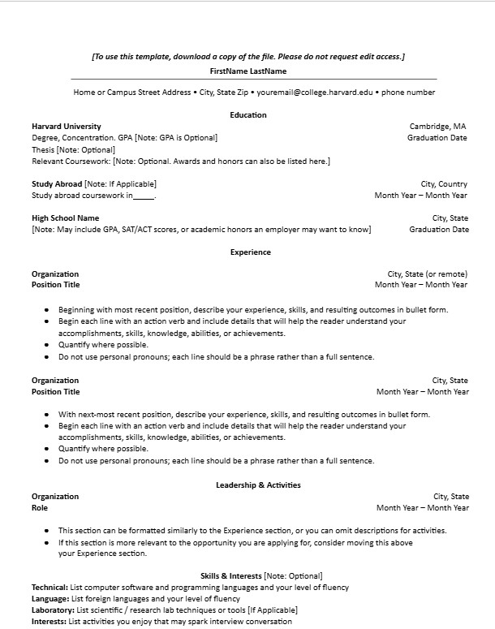
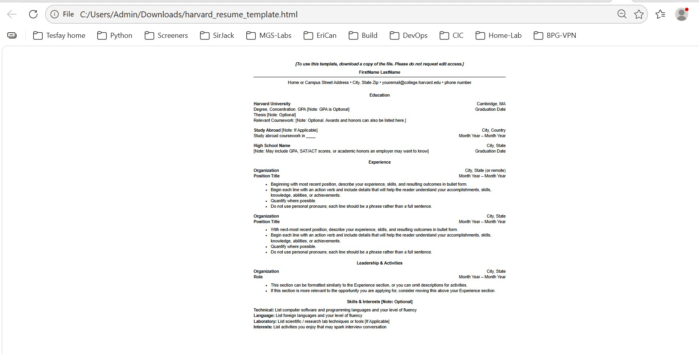

# Frontend Technical Specificatin 

- Create a static website that serves an html resume. 

## Resume Format Considerations

I live in Canada and the resumes in word / pdf format as suppose to exclude 
information e.g Age, relationship. Canada resume don't often include GPA grades.  

In Canada we use a similiar format of resume common in the US. 
I'm going to user the [Harvard Resume Template formart](https://careerservices.fas.harvard.edu/resources/harvard-college-resume-example-tech/) as the basis of my resume. 

### Harvard Resume Format Generation

I know how HTML very well, so I'm going to let GenAI do the heavy lifting and generate out html HTML and possibly CSS and from there I will manually refactor the code to prefered standard. 

Prompt to ChatGPT 5: 

``` text 
Convert this resume format into html.
Please don't use a css framework. 
Please use the least amount of css tags
```

Image provided to LLM: 


This is the [generated output](./docs/april-18-2026-resume-minimal.html) which I will refactor.

## HTML Adjustments 

This is what the generated HTML looks like unaltered. 


- UTF8 will support most languages, I plan to use English and Geez so we'll leave this meta tag in. 
- Because we will be applying mobile stylig to our website we'll include the viewport meta tag width=device-width so mobile styling scales normally. 
- we'll extract our styles into its own stylesheet after we are happy with our HTML markup 
- we'll simplfy out HTML markup css selector to be as minimal as possible. 
- For the HTML page I'll use soft tabs because I mostly code in Ruby and that's the standard tab formart. 